# Portal Administrativo

Portal para gestão de clientes, permitindo cadastro, edição, listagem e remoção de clientes, além da autenticação de usuários.

## Funcionalidades
- Cadastro e login de usuários.
- Gerenciamento de clientes.
- Associação de múltiplos endereços a um cliente.
- Proteção de rotas por autenticação.

---
## Passo a passo para executar o projeto

### 1) Clonar o repositório
```sh
    git clone git@github.com:Vitor8/challenge.git
```

### 2) Configurar banco de dados
Na raiz do projeto, há um arquivo chamado **.env.example**. Substitua as variáveis desse arquivo de acordo com as configurações do seu MySQL local. O nome do banco de dados pode ser de sua escolha; a própria aplicação irá criá-lo automaticamente. Após a configuração, renomeie o arquivo para **.env**.

**Exemplo de configuração:**
```env
DB_HOST=YOUR_HOST
DB_NAME=YOUR_DBNAME
DB_USER=YOUR_USERNAME
DB_PASS=YOUR_PASSWORD
```

### 3) Iniciar aplicação
Na raiz do projeto, digite o seguinte comando para iniciar o servidor local:
```sh
    php start.php
```
A aplicação estará disponível em:
```
http://localhost:8000
```

### 4) Executar testes
Para rodar os testes automatizados do projeto, execute:
```sh
    php test.php
```

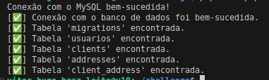

---
## Estrutura do Projeto

```plaintext
challenge/
│-- .env
│-- .env.example
│-- env.php
│-- open_index.php
│-- router.php
│-- routes.php
│-- start.php
│-- test.php
│
├── controllers/
│   ├── ClientsController.php
│   ├── LoginController.php
│
├── core/
│   ├── AuthMiddleware.php
│   ├── DB.php
│   ├── Request.php
│   ├── View.php
│
├── database/
│   ├── create_database.php
│   ├── create_migrations_table.php
│   ├── database.php
│   ├── migrate_all.php
│   ├── revert_all.php
│   ├── migrations/
│   │   ├── 2025_02_25_000000_create_usuarios_table.php
│   │   ├── 2025_02_26_000000_create_clients_table.php
│   │   ├── 2025_02_26_000001_create_addresses_table.php
│   │   ├── 2025_02_26_000002_create_client_address_table.php
│
├── frontend/
│   ├── client.php
│   ├── index.php
│   ├── list.php
│   ├── register.php
│   ├── includes/
│   │   ├── head.php
│   │   ├── messages.php
│   │   ├── scripts.php
│
├── models/
│   ├── Address.php
│   ├── BaseModel.php
│   ├── Client.php
│   ├── ClientAddress.php
│   ├── User.php
│
└── tests/
    ├── DatabaseTest.php
```

---
## Arquitetura do Projeto
O projeto segue a arquitetura **Model-View-Controller (MVC)** para organizar e separar responsabilidades.

### 📂 **Controllers** (`controllers/`)
Contém os controladores responsáveis por processar requisições, validar dados e chamar os models apropriados.
- **ClientsController.php**: Gerencia todas as operações relacionadas aos clientes.
- **LoginController.php**: Responsável pelo login e autenticação de usuários.

### 📂 **Models** (`models/`)
Camada responsável pela interação com o banco de dados. Cada model representa uma tabela do banco.
- **BaseModel.php**: Classe base para todos os models.
- **User.php**: Model para usuários do sistema.
- **Client.php**: Model para clientes.
- **Address.php**: Model para endereços.
- **ClientAddress.php**: Model intermediário para a relação cliente-endereço.

### 📂 **Views** (`frontend/`)
Contém os arquivos HTML/PHP que representam a interface do usuário.
- **index.php**: Tela de login.
- **register.php**: Tela de registro de usuários.
- **list.php**: Lista de clientes.
- **client.php**: Formulário para adicionar/editar clientes.
- **includes/**: Arquivos compartilhados entre as views.
  - **head.php**: Importação de estilos.
  - **messages.php**: Exibição de mensagens de erro/sucesso.
  - **scripts.php**: Importação de scripts JavaScript.

### 📂 **Banco de Dados** (`database/`)
Scripts para configuração e migração do banco de dados.
- **create_database.php**: Cria o banco de dados.
- **database.php**: Gerencia a conexão com o banco.
- **migrate_all.php**: Executa todas as migrations.
- **revert_all.php**: Reverte todas as migrations.

### 📂 **Testes** (`tests/`)
Scripts para validar a integridade do sistema.
- **DatabaseTest.php**: Testes unitários para verificar a conexão e existência das tabelas.

### 📂 **Core** (`core/`)
Contém classes auxiliares essenciais para o funcionamento do projeto.
- **DB.php**: Gerencia a conexão com o banco de dados.
- **Request.php**: Lida com requisições HTTP e parâmetros.
- **View.php**: Renderiza as views e passa variáveis.
- **AuthMiddleware.php**: Controla o acesso às rotas protegidas.

### 📄 **Principais Arquivos da Raiz**
- **routes.php**: Define todas as rotas da aplicação.
- **router.php**: Processa as requisições e direciona para os controladores corretos.
- **start.php**: Arquivo principal que inicia o servidor e configura o banco.
- **test.php**: Roda os testes automatizados.
- **open_index.php**: Redireciona para a página inicial.

---

## 📸 Capturas de Tela

### 🖥️ Tela 1: Tela de Login

A tela inicial do sistema, onde os usuários podem realizar o login. Caso as credenciais inseridas estejam incorretas, uma mensagem de erro será exibida. Além disso, se um usuário não autenticado tentar acessar qualquer página restrita, será automaticamente redirecionado para esta tela com uma notificação de acesso negado. Para criar uma conta, basta clicar no link **"Não é cadastrado? Clique aqui para registrar-se"**.

A autenticação do sistema é baseada em **cookies e tokens de autenticação**. Ao realizar o login com sucesso, um **token único** é gerado e armazenado no banco de dados, junto com um prazo de expiração. Esse token é então enviado para o navegador do usuário via **cookie HTTP-Only**, garantindo que ele não possa ser acessado diretamente por JavaScript, aumentando a segurança. Em cada requisição, o sistema verifica se o **cookie ainda é válido e se o token armazenado no banco de dados ainda não expirou**. Caso contrário, o usuário é automaticamente deslogado e redirecionado para a página de login.

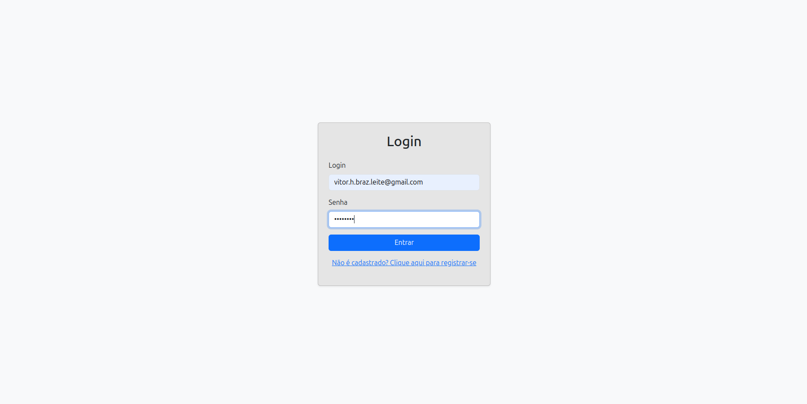

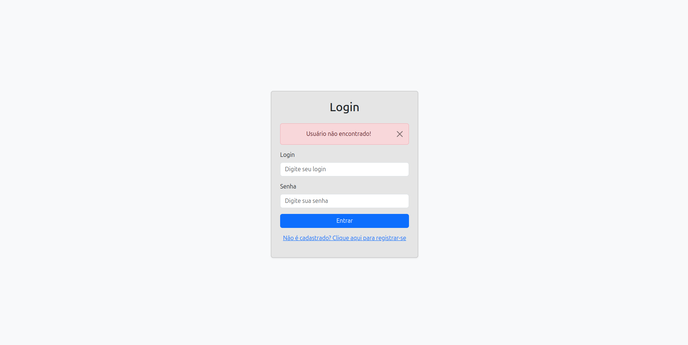

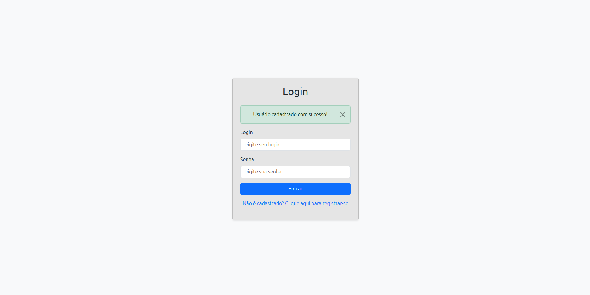

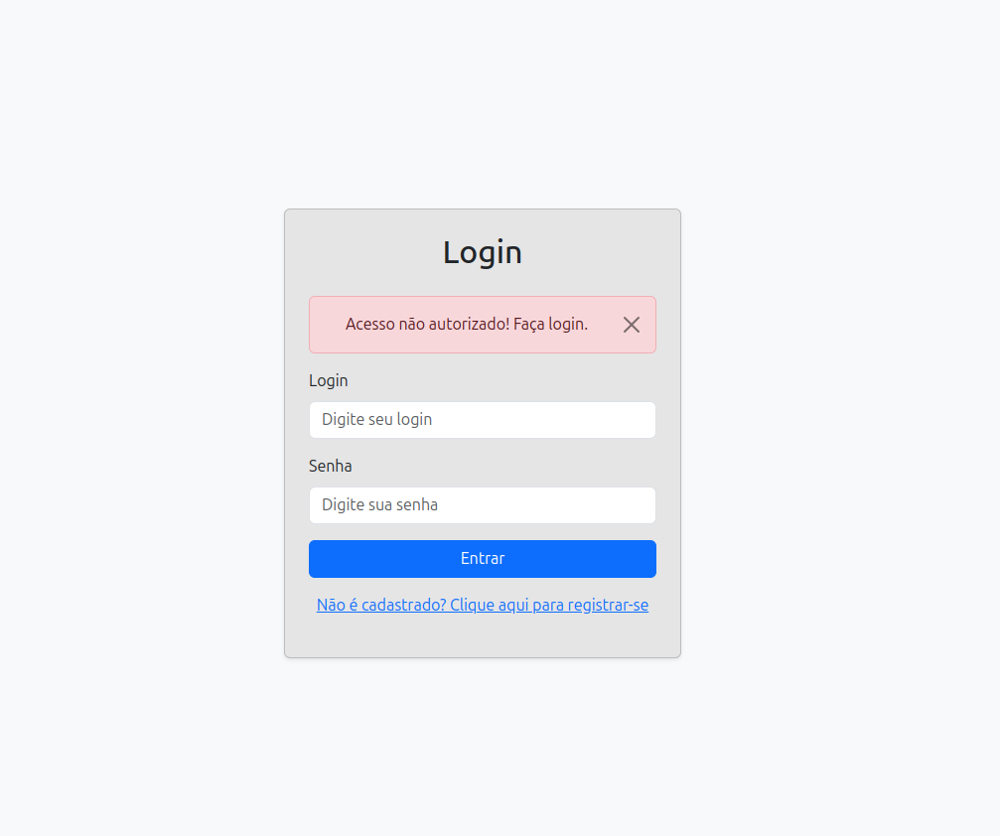

---

### 2️⃣ Tela de Cadastro de Usuário
Aqui, novos usuários podem ser cadastrados no sistema. O login deve ser único e a senha deve conter no mínimo **8 caracteres**. Caso os critérios de senha não sejam atendidos ou o login já exista, mensagens de erro apropriadas serão exibidas.


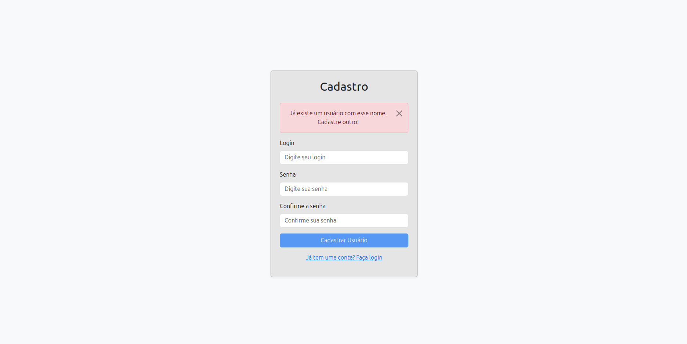

---

### 3️⃣ Tela de Listagem de Clientes
Esta tela exibe a listagem completa dos clientes cadastrados. A navegação entre os registros pode ser feita pelos botões **"Anterior"** e **"Próximo"**, que permitem percorrer os clientes de forma paginada.

- Na coluna **"Endereços"**, todos os endereços associados a um cliente são exibidos, separados por `";"`.
- A última coluna contém os ícones para **editar** e **excluir** um cliente.
- O botão **"Novo Cliente +"**, localizado abaixo do título, direciona o usuário para a **tela de cadastro de clientes**.

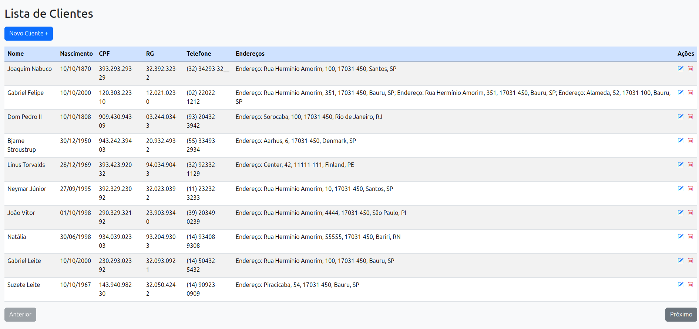

---

### 4️⃣ Tela de Cadastro de Clientes
Nesta tela, novos clientes podem ser cadastrados. Além dos dados básicos, como **nome, CPF, RG, telefone e data de nascimento**, também é possível adicionar **múltiplos endereços** para cada cliente.

- O botão **"+"** permite adicionar novos endereços.
- Cada endereço é preenchido dentro de um **card**, contendo os campos necessários (CEP, rua, número, bairro, cidade e estado).
- Pelo menos um endereço é obrigatório.

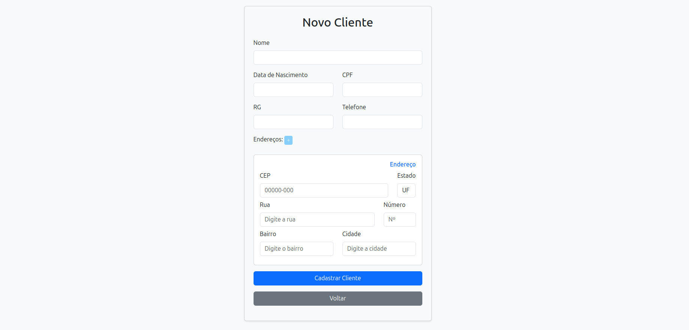

---

### 5️⃣ Tela de Edição de Clientes
Se um usuário clicar no ícone de **edição** na listagem de clientes, ele será redirecionado para esta tela. A interface de edição possui a mesma estrutura da tela de cadastro, porém, **todos os dados do cliente são preenchidos automaticamente ao carregar a página**.

- O usuário pode modificar os dados pessoais do cliente e seus endereços.
- O botão de **salvar** atualiza os dados no banco de dados.

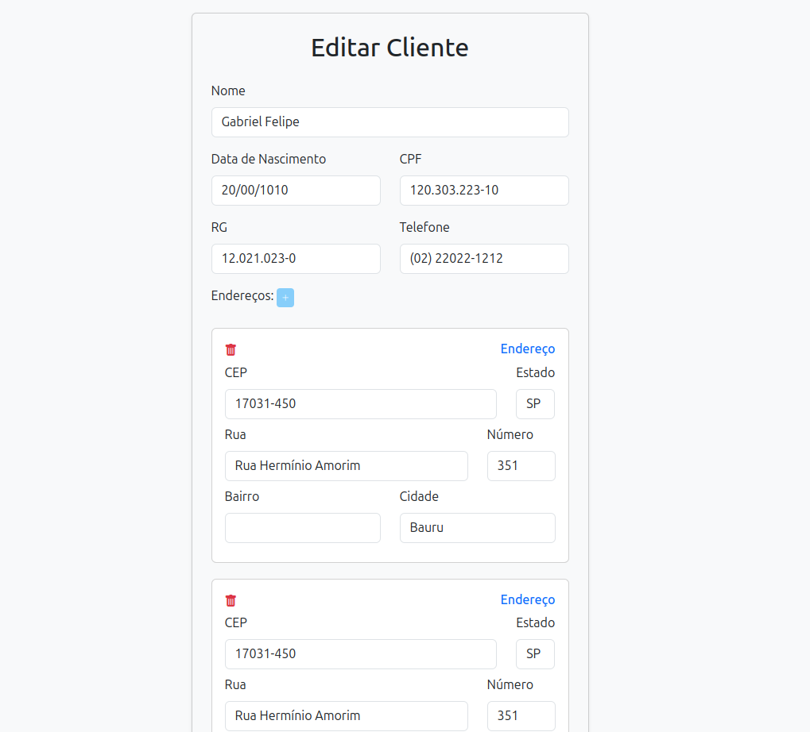
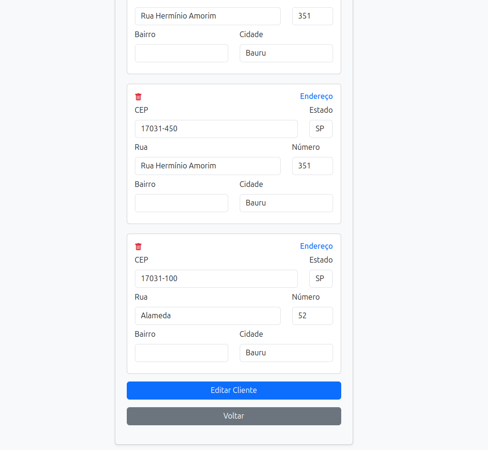
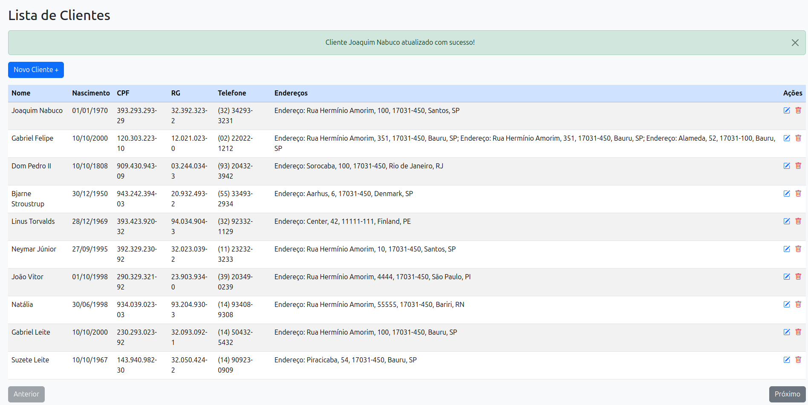

---

### 6️⃣ Confirmação de Exclusão de Cliente
Se o usuário clicar no ícone de **exclusão** (lixeira) na listagem de clientes, um **alerta do SweetAlert** será exibido solicitando a confirmação da remoção.

- Se o usuário confirmar, o cliente será **excluído permanentemente**.
- Se o usuário cancelar, nenhuma ação será realizada.

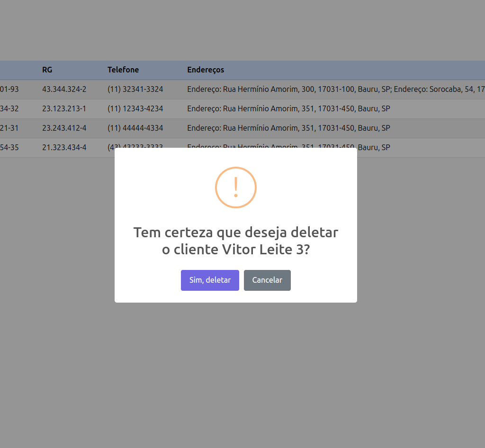
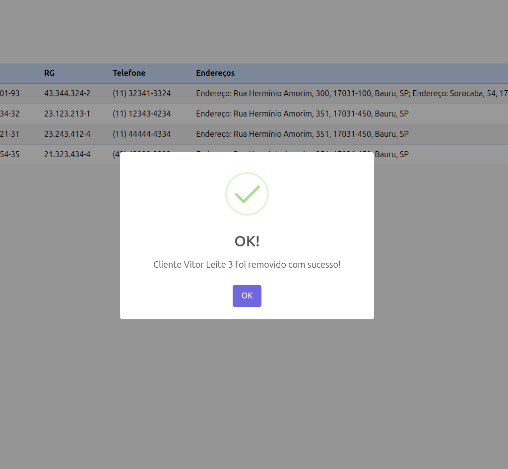

## 📜 Licença
Este projeto foi desenvolvido para fins acadêmicos e de aprendizado.

🚀 **Agora, basta seguir as instruções e rodar o projeto!**

